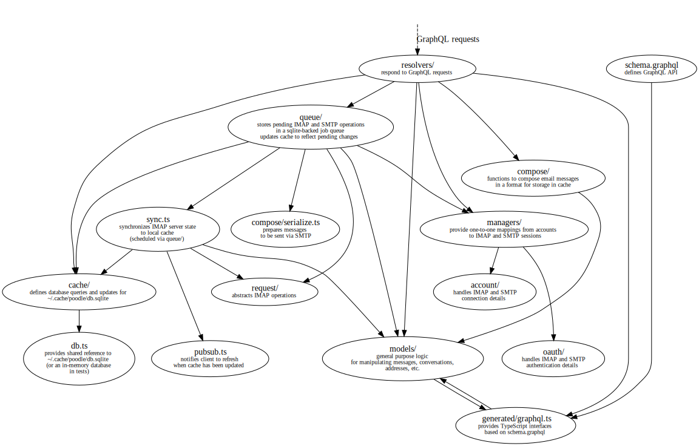

# poodle

Experimental email client with social features.
Poodle is in very early stages of development, so functionality is limited!

## Building and running from source

### Prerequisites

Running from source is supported on macOS and Linux.
You might have success with the Linux Subsystem on Windows.

You must have these programs installed:

- g++
- Node v8 or later
- tmux
- yarn v0.26.0 or later

On macOS you can get g++ by installing the
[Apple Command Line Tools Package][].
On Debian-based Linux systems you can get it by installing the
`build-essential` package.

[Apple Command Line Tools Package]: https://developer.apple.com/library/content/technotes/tn2339/_index.html

The easiest way to get the current version of Node is to run the
[nvm install script][nvm].
Follow the instructions printed by the installer,
and then run these commands to set the current stable Node release as your
default node:

    $ nvm install stable
    $ nvm alias default stable

[nvm]: https://github.com/creationix/nvm#install-script

If your package manager does not have a recent version of yarn available you
can get the latest version by following instructions on the
[yarn installation][yarn] page.

[yarn]: https://yarnpkg.com/lang/en/docs/install/

On Linux you also need some development libraries installed for building npm
modules with native dependencies.
On Debian-based systems the required dependencies are:

- `libgnome-keyring-dev`
- `libsecret-1-dev`

### Running

In the top level directory run the command:

    $ yarn && yarn start

## Design

Poodle is a mono-repo divided into two indepedent NPM projects,
`packages/main/` and `packages/client/`.
Both run locally when the app is installed. `main` is a background Node process
that manages all interactions with the email provider. `main` provides
a GraphQL service that `client` connects to via inter-process communication
(IPC). `client` is a React app that runs as an Electron renderer process.

Here is an architecture diagram of the `main` package:

Poodle uses code generation to generate TypeScript based on a GraphQL schema
and operations. The generated code ensures that client GraphQL queries
keep in sync with schema used by the main process. The schema is in
`packages/main/schema/schema.graphql`, and client operations are defined in
`packages/client/src/documents/operations.graphql`. Each of the `main` and
`client` packages has a `yarn codegen` script that updates the generated code.
Make sure to run these scripts after making any changes to either graphql file!

Some GraphQL types are mapped to TypeScript types in hand-written code. See
`packages/main/codegen.yml` to see how types are mapped.

`sync.ts` gets updated state from an IMAP server and updates the local cache
accordingly. It is designed according to recommendations in
[RFC 4549 - Synchronization Operations for Disconnected IMAP4 Clients][RFC 4549].
To avoid prematurely undoing optimistic changes to local cache state,
we wait for pending upstream operations to complete before running a sync.
This is accomplished by scheduling a sync via `queue/` and giving it a low
priority.

[RFC 4549]: https://tools.ietf.org/html/rfc4549
